

 

 

<a href="https://k-five.github.io/badge-for-git/" >
  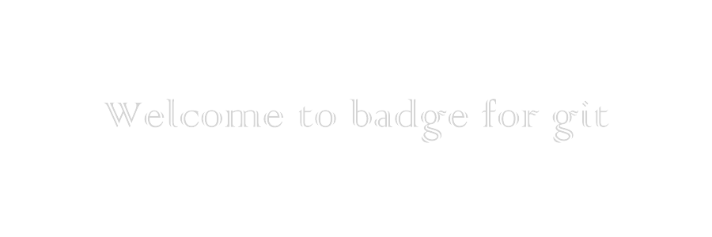
</a>

<h1 id="hi" align="center">Hi</h1>
 

 - `badge 6 'type:web-app'`
 - 
 - `badge 6 'birth:Date()'`
 - 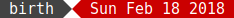
 - `badge 6 'name:badge for git(hub)'`
 - 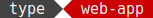
 - `badge 6 'support:all modern browsers'`
 - 

 
 

<h1 id="prerequisite" align="center" >prerequisite</h1>

  &#9898; <a href="https://k-five.github.io/badge-for-git/">create</a>
  &#9899; prerequisite
  &#9898; <a href="#howto">how-to</a>
  &#9898; <a href="#feature">feature</a>
  &#9898; <a href="#troubleshooting">troubleshooting</a>
  &#9898; <a href="#color-guide">color-guide</a>
  &#9898; <a href="#dynamic_version">dynamic-version</a>
  &#9898; <a href="#bottom">bottom</a>
  &#9898; <a href="#top">top</a>

 

 1. A font of `monospace` family. Default is: `'DejaVu Sans Mono', 'Source code variable', monospace`
 2. Modern Browsers which can support **SVG** and **CSS Animation**, also **copy to clipboard**

<h3>assumption</h3>

  1. You are familiar with **Terminal** and with basic commands like: `ls`, `cd`, `cat`, etc.  
  2. You know how to use/apply colors in **Hex** value like: `#CB0000` or `#434343` 

 
<h3>if</h3>

 1. you are a user/member of **Stack-overflow** then first visit: [badge-for-stackoverflow](https://github.com/k-five/badge-for-stackoverflow)  
 2. you are not familiar with **Hex Color** then read the <a href="#color-guide">color-guide</a> at the bottom or just visit [w3schools-color-ref](https://www.w3schools.com/colors/colors_fs595.asp)  
 3. you have any questions, suggestions, ideas, doubts, critical they are welcome :) raise an issue  

 
<h3>else</h3>

<h1>
  <a href="https://k-five.github.io/badge-for-git/" >start creating</a>
</h1>

 
 

<h1 id="howto" align="center" >how to</h1>

  &#9898; <a href="https://k-five.github.io/badge-for-git/">create</a>
  &#9898; <a href="#prerequisite">prerequisite</a>
  &#9899; how-to
  &#9898; <a href="#feature">feature</a>
  &#9898; <a href="#troubleshooting">troubleshooting</a>
  &#9898; <a href="#color-guide">color-guide</a>
  &#9898; <a href="#dynamic_version">dynamic-version</a>
  &#9898; <a href="#bottom">bottom</a>
  &#9898; <a href="#top">top</a>

 

You will open <a href="https://k-five.github.io/badge-for-git/">the app</a>, try generating a badge based on a style that is available and its command.
For example: `badge 20 "made-with:for-you"`  based on style 20 will generate a SVG file and you
will see it on the screen as well. Meanwhile the last SVG file you have created, its **source-code**
will be copied to your **clipboard** and that is it. It is ready to use.
Then you can go to your own repository and create a new file with `svg` extension. like: `for-you.svg`
Paste the code there and save it. It is ready to use on/in your **README.md** file.

<h3>step 1 generate code:</h3>
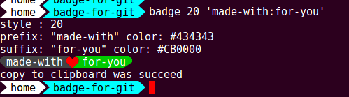

 
<h3>step 2 create new file:</h3>
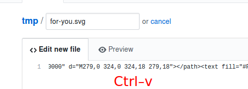</td>

 
<h3>step 3 commit new file:</h3>
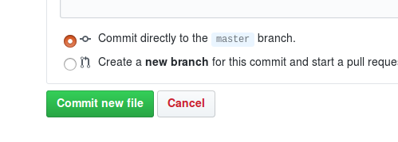</td>

 
<h3>step 4 (optional) click on the SVG file:</h3>
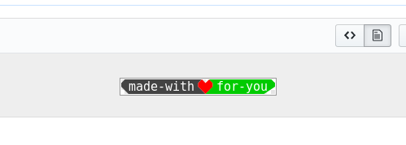</td>

 
<h3>step 5 copy its link:</h3>
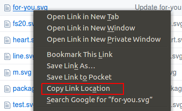</td>

 
<h3>step 6 add a link to it in your README file:</h3>
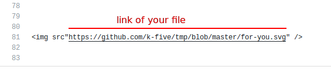</td>

 
<h3>and here it the result:</h3>
</td>

 
 

<h1 id="feature" align="center">feature</h1>

  &#9898; <a href="https://k-five.github.io/badge-for-git/">create</a>
  &#9898; <a href="#prerequisite">prerequisite</a>
  &#9898; <a href="#hoeto">hoe-to</a>
  &#9899; feature
  &#9898; <a href="#troubleshooting">troubleshooting</a>
  &#9898; <a href="#color-guide">color-guide</a>
  &#9898; <a href="#dynamic_version">dynamic-version</a>
  &#9898; <a href="#bottom">bottom</a>
  &#9898; <a href="#top">top</a>

 

 - diversity (= about 20 styles)  
 - speed (= fast and straightforward SVG generation) try `badge 1..20 "bfg:bfg"`  
 - simplicity (= based on [constant-width font](https://en.wikipedia.org/wiki/Monospaced_font), so no `<scale>`, `<transform>`, `<textLength>`, `<rotate>` )
 - `0%` mouse requirement (I dislike using mouse)  
 - auto-copy source-code to your clipboard  
 - log everything to console (for developers)  
 - unlimited/flexible suffix repetition (regular or empty)  
 - unlimited/flexible change-size  
 - unrestricted background/foreground-color  
 - prefix/suffix separation for make it even more beautiful  
 - unlimited new ideas (you can create your own style just by adding a single function)  

 
<h3>Why is that?</h3>  

In **January 18th 2018** in the <a href="https://discord.gg/HjJCwm5">shields.io chat-room</a>

> Hi. Is there any one help me about dynamic badge?  I always get: invalid resource ...

 
<h2 id="diversity" >diversity</h2>
 

<table>
    <tr>
      <th>sample</th>
      <th>suffix-repetition</th>
      <th>change-size</th>
      <th>bg/fg-color</th>
      <th>separation</th>
    </tr>
    <tr>
      <td>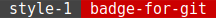</td>
      <td>Yes</td>
      <td>Yes</td>
      <td>Yes</td>
      <td>Yes</td>
    </tr>
    <tr>
      <td></td>
      <td> </td>
      <td>Yes</td>
      <td>Yes</td>
      <td>No</td>
    </tr>
    <tr>
      <td>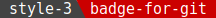</td>
      <td> </td>
      <td>Yes</td>
      <td>Yes</td>
      <td>No</td>
    </tr>
    <tr>
      <td></td>
      <td>Yes</td>
      <td>Yes</td>
      <td>Yes</td>
      <td>Yes</td>
    </tr>
    <tr>
    <td></td>
      <td>Yes</td>
      <td>Yes</td>
      <td>Yes</td>
      <td>Yes</td>
    </tr>
    <tr>
      <td></td>
      <td> </td>
      <td>Yes</td>
      <td>Yes</td>
      <td>No</td>
    </tr>
    <tr>
      <td></td>
      <td>Yes</td>
      <td>Yes</td>
      <td>Yes</td>
      <td>Yes</td>
    </tr>
    <tr>
      <td></td>
      <td> </td>
      <td>Yes</td>
      <td>Yes</td>
      <td>No</td>
    </tr>
    <tr>
      <td></td>
      <td>Yes</td>
      <td>Yes</td>
      <td>Yes</td>
      <td>Yes</td>
    </tr>
    <tr>
      <td></td>
      <td>Yes</td>
      <td>Yes</td>
      <td>Yes</td>
      <td>Yes</td>
    </tr>
    <tr>
      <td></td>
      <td>Yes</td>
      <td>Yes</td>
      <td>Yes</td>
      <td>Yes</td>
    </tr>
    <tr>
      <td></td>
      <td>Yes</td>
      <td>Yes</td>
      <td>Yes</td>
      <td>Yes</td>
    </tr>
    <tr>
      <td></td>
      <td> </td>
      <td>Yes</td>
      <td>Yes</td>
      <td>No</td>
    </tr>
    <tr>
      <td></td>
      <td> </td>
      <td>Yes</td>
      <td>Yes</td>
      <td>No</td>
    </tr>
    <tr>
      <td></td>
      <td>Yes</td>
      <td>Yes</td>
      <td>Yes</td>
      <td>Yes</td>
    </tr>
    <tr>
      <td></td>
      <td>Yes</td>
      <td>Yes</td>
      <td>Yes</td>
      <td>Yes</td>
    </tr>
    <tr>
      <td></td>
      <td>Yes</td>
      <td>Yes</td>
      <td>Yes</td>
      <td>Yes</td>
    </tr>
    <tr>
      <td></td>
      <td>Yes</td>
      <td>Yes</td>
      <td>Yes</td>
      <td>Yes</td>
    </tr>
    <tr>
      <td></td>
      <td>Yes</td>
      <td>Yes</td>
      <td>Yes</td>
      <td>Yes</td>
    </tr>
    <tr>
      <td></td>
      <td>No</td>
      <td>No</td>
      <td>Yes</td>
      <td>No</td>
    </tr>
</table>
 

<h2>unlimited/flexible suffix repetition (regular or empty)</h2>
 

 - `badge 17 'one:two:three:four:five:six:seven:eight:nine:ten'`
 -   
 - `badge 17 'one::two::three::four::five'`
 -   
 - `badge 17 '::::::::::::::::::::'`
 -   
 - `'DLM=10'`
 - `badge 17 '::::::::::::::::::::'`
 -   

 
<h2>unlimited/flexible change-size</h2>
 

 - `bfs 5`  
 - `badge 20 'made-with:for-you'`  
 -   
 - `bfs 99`  
 - `badge 20 'made-with:for-you'`  
 -   

 
<h2>unrestricted background/foreground-color</h2>
 

 - `badge 7 '#CB0000:#434343' #CB0000:#434343`
 - 
 - `BTC=#FF0`
 - `badge 7 '#CB0000:#434343:and text color is #FF0'`
 - 

 
<h2>prefix/suffix separation</h2>
 

 - for styles: 1, 4, 5, 7, 9, 10, 11, 12, 15, 16, 17, 18 and 19  
 - `DLM=5`  
 - `badge 9 'platfrom:Linux:Windows:Mac'` 
 -   
 - `DLM=30`  
 - `badge 9 'platfrom:Linux:Windows:Mac'` 
 -   
 - `DLM=10`  
 - `badge 17 'do::::::you::::::like::::::this'`
 -   
 - `DLM=5`  
 - `badge 12 'do::::::you::::::like::::::this'`
 -   

 
<h2>theme</h2>
 

<h4>Github (default)</h4>

 - `bt G`
 - `badge 9 'theme:G:github'`
 - 

<h4>Stack-overflow</h4>

 - `bt S`
 - `badge 9 'theme:S:stack-overflow'`
 - 

<h4>Twitter</h4>

 - `bt T`
 - `badge 9 'theme:T:twitter'`
 - 

<h4>Facebook</h4>

 - `bt F`
 - `badge 9 'theme:F:facebook'`
 - 

 
 

<h1 id="troubleshooting" align="center" >troubleshooting</h1>

  &#9898; <a href="https://k-five.github.io/badge-for-git/">create</a>
  &#9898; <a href="#prerequisite">prerequisite</a>
  &#9898; <a href="#hoeto">hoe-to</a>
  &#9898; <a href="#feature">feature</a>
  &#9899; troubleshooting
  &#9898; <a href="#color-guide">color-guide</a>
  &#9898; <a href="#dynamic_version">dynamic-version</a>
  &#9898; <a href="#bottom">bottom</a>
  &#9898; <a href="#top">top</a>

 

<h3>old browser</h3>

 - if the code is NOT copied to your clipboard, then use `shc` command (= show-clipboard) it appears at the top-right corner  
 - if you want to see the source-code, hit `alt-v` (= verbose) and then open your console (in you browser). source-code is logged there  

<h3>inaccurate result</h3>

 - run `df` command and you should get a nice and clean output (not messy)  
 - make sure you have the correct **font**, see the <a href="#prerequisite">prerequisite</a> section above  
 - hit `alt-l` and open your console (in browser) and see if everything is logged appropriately or not  
 - do NOT zoom in/out, instead use `fs` (= font-size) and `bfs` (= badge-font-size) commands  
 - change your browser. Different browsers handle character height/width differently.

<h3>funky mouse movement</h3>

 - change your browser. Different browsers handle character height/width differently.

<!-- <h1>handy tips</h1> -->

<!-- <h3>horizontal lines</h3> -->

<!--  - you can create horizontal lines with:   -->
<!--  - `badge 1 '::::::::::::::::::::::::::::::::::::::::'`   -->
<!--  - `badge 7 '::::::::::::::::::::::::::::::::::::::::'`   -->
<!--  - `badge 17 '::::::::::::::::::::::::::::::::::::::::'`   -->
<!--  - here is the result, (but do NOT do this) it is very inefficient. Instead, use `line` command. -->

<!--  -->
<!--  -->
<!--  -->

 
 

<h1 id="color_guide" align="center" >color guide</h1>

  &#9898; <a href="https://k-five.github.io/badge-for-git/">create</a>
  &#9898; <a href="#prerequisite">prerequisite</a>
  &#9898; <a href="#hoeto">hoe-to</a>
  &#9898; <a href="#feature">feature</a>
  &#9898; <a href="#troubleshooting">troubleshooting</a>
  &#9899; color-guide
  &#9898; <a href="#dynamic_version">dynamic-version</a>
  &#9898; <a href="#bottom">bottom</a>
  &#9898; <a href="#top">top</a>

 

This is a very compact and brief tutorial that you can quickly learn and memorize **hex-color-value**  
important:  
 1. do NOT think of these values (e.g `#FF0000`) as a single number or single quantity  
 2. ignore the leading symbol `#`. It is not important  
 3. separate them in your mind and when you see `#FF0000`, think about `FF`, `00` and `00`  

Now, since we can represent any colors by mixing the **red**, **green** and **blue** color, each of this value is  
for representing one of these main color.  

 - `FF,__,__` is for representing  color or in binary `11111111,00000000,00000000` or in decimal `255,0,0`  
 - `__,FF,__` is for representing  color or in binary `00000000,11111111,00000000` or in decimal `0,255,0`  
 - `__,__,FF` is for representing  color or in binary `00000000,00000000,11111111` of in decimal `0,0,255`  

You should (have to) memorize these three colors and the position of each, which comes in this order:  

 - `red,green,blue`  or `FF,FF,FF` or `255,255,255`  

Now instead of trying to memorize a number from `0` to `255` or to `FF`, divide 255 by **25** which we get 11 values and then we can memorize these, easily.  
Here is a table and these **11** values which I memorized them. Even if you forgot them you can use the hex value equivalent of

 - (decimal) 0, 25, 50, 75, 100, 125, 150, 175, 200, 225 and 250 which we can round it up to 255 which can be  
 - (hex    ) 0, 19, 32, 4B, 64,  7D,  96,  AF,  C8,  E1  and FA which we can round it up to FF  

Now it is easier to memorize these eleven, other than 255 values (e.g 0 to 255).  

 - need bright red, use `FF`
 - need dark red use `C8` or `AF`

 

<table>
  <tr>
    <th>hex (= decimal)</th>
    <th>red: #XX0000</th>
    <th>green: #00XX00</th>
    <th>blue: #0000XX</th>
    <th>mix: #XXXXXX</th>
  </tr>
  <tr>
    <td>0 (= 0)</td>
    <td></td>
    <td></td>
    <td></td>
    <td></td>
  </tr>
  <tr>
    <td>19 (= 25)</td>
    <td></td>
    <td></td>
    <td></td>
    <td></td>
  </tr>
  <tr>
    <td>32 (= 50)</td>
    <td></td>
    <td></td>
    <td></td>
    <td></td>
  </tr>
  <tr>
    <td>4B (= 75)</td>
    <td></td>
    <td></td>
    <td></td>
    <td></td>
  </tr>
  <tr>
    <td>64 (= 100)</td>
    <td></td>
    <td></td>
    <td></td>
    <td></td>
  </tr>
  <tr>
    <td>7D (= 125)</td>
    <td></td>
    <td></td>
    <td></td>
    <td></td>
  </tr>
  <tr>
    <td>96 (= 150)</td>
    <td></td>
    <td></td>
    <td></td>
    <td></td>
  </tr>
  <tr>
    <td>AF (= 175)</td>
    <td></td>
    <td></td>
    <td></td>
    <td></td>
  </tr>
  <tr>
    <td>C8 (= 200)</td>
    <td></td>
    <td></td>
    <td></td>
    <td></td>
  </tr>
  <tr>
    <td>E1 (= 225)</td>
    <td></td>
    <td></td>
    <td></td>
    <td></td>
  </tr>
  <tr>
    <td>FF (= 255)</td>
    <td></td>
    <td></td>
    <td></td>
    <td></td>
  </tr>
</table>

Even if these **11** values seem hard for you can divide 256 by **64** and only memorize 5 numbers  

 - (decimal) 0, 64, 128, 192, 255  
 - (hex    ) 0, 40, 80,  C0,  FF  

if you are wonder/curious about other colors like **yellow** and **orange**, they are just created by combing these three **red**, **green** and **blue**  

 - yellow: full-red and full-green = `#FFFF00`  
 - cyan: full-green and full-blue = `#00FFFF`  
 - purple: full-red and full-blue = `#FF00FF`  
 - orange: full-red and half-green = `#FF8000` (= `FF` and `80` and `00`) or (= 255, 128, 0)  

 
 

<h1 id="dynamic_version" align="center">dynamic-version</h1>

  &#9898; <a href="https://k-five.github.io/badge-for-git/">create</a>
  &#9898; <a href="#prerequisite">prerequisite</a>
  &#9898; <a href="#hoeto">hoe-to</a>
  &#9898; <a href="#feature">feature</a>
  &#9898; <a href="#troubleshooting">troubleshooting</a>
  &#9898; <a href="#color_guide">color-guide</a>
  &#9899; dynamic-version
  &#9898; <a href="#bottom">bottom</a>
  &#9898; <a href="#top">top</a>

 

 
 

<h1 id="license" align="center">license</h1>

  &#9898; <a href="https://k-five.github.io/badge-for-git/">create</a>
  &#9898; <a href="#prerequisite">prerequisite</a>
  &#9898; <a href="#hoeto">hoe-to</a>
  &#9898; <a href="#feature">feature</a>
  &#9898; <a href="#troubleshooting">troubleshooting</a>
  &#9898; <a href="#color_guide">color-guide</a>
  &#9898; <a href="#dynamic_version">dynamic-version</a>
  &#9899; bottom
  &#9898; <a href="#top">top</a>

 

  badge-for-git copyright &copy; 2018 Shakiba
   
   
  ▒█▀▄▀█ ▀█▀ ▀▀█▀▀ 
  ▒█▒█▒█ ▒█░ ░▒█░░ 
  ▒█░░▒█ ▄█▄ ░▒█░░ 

